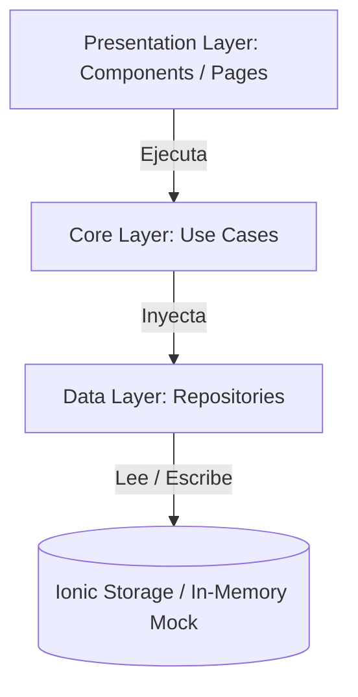

<p align="center">
  
</p>

<h1 align="center">memory-game</h1>

<p align="center">
  <b>Juego de memoria interactivo construido con Ionic, Angular, TypeScript y Clean Architecture</b>
</p>

<p align="center">
  <a href="https://www.typescriptlang.org/"></a>
  <a href="https://angular.dev/"></a>
  <a href="https://ionicframework.com/"></a>
  <a href="https://pnpm.io/"></a>
  <a href="./LICENSE"></a>
</p>

---

**memory-game** es una aplicación web e híbrida desarrollada con **Ionic 8** y **Angular 19**, enfocada en demostrar la aplicación práctica de **Clean Architecture** (Arquitectura Limpia) en aplicaciones frontend modernas. 

El usuario puede ingresar su apodo (nickname), iniciar una partida de emparejamiento de números romanos, medir su tiempo de resolución en tiempo real mediante un cronómetro y rastrear la cantidad de intentos realizados.

---

## Qué incluye

- 🎮 **Juego de Memoria Interactivo**: Sistema de volteo dinámico de cartas con lógica de emparejamiento y deshabilitación.
- ⏱️ **Cronómetro en Tiempo Real**: Componente modular de temporizador formateado en `MM:SS` mediante pipes personalizados.
- 👤 **Persistencia de Jugador**: Guardado y recuperación del apodo utilizando `@ionic/storage-angular`.
- 🏛️ **Arquitectura Limpia (Clean Architecture)**:
  - **Core Layer**: Contiene los casos de uso (`UseCases`), entidades del dominio e interfaces de repositorios.
  - **Data Layer**: Implementaciones concretas de acceso a datos (`StorageNicknameRepository`, `RomanCardRepository`, `FakeCardRepository`).
  - **Presentation Layer**: Componentes de UI, páginas, guardias de navegación (`HasNicknameGuard`) y pipes.
- ⚡ **Alto Rendimiento**: Migrado a **pnpm** como gestor de paquetes y acelerado con el compilador `browser-esbuild` de Angular 19.

---

## Arquitectura del Proyecto

```text
src/app/
├── config/               # Configuración e Inyección de Dependencias (Service Providers)
├── core/                 # Capa de Dominio (Casos de Uso, Entidades e Interfaces de Repositorios)
│   ├── base/             # Contratos e Interfaces Base
│   ├── cards/            # Casos de uso y entidades para Cartas
│   └── nickname/         # Casos de uso y entidades para Nickname
├── data/                 # Capa de Datos (Implementaciones concretas de Repositorios)
│   └── repositories/     # Storage, Repositorios de números romanos y datos de prueba (Mocks)
└── presentation/         # Capa de Presentación (UI, Vistas y Componentes)
    ├── admin/            # Escenario del Juego (Gaming Stage)
    ├── home/             # Registro del Jugador
    └── shared/           # Componentes reutilizables (Card, Timer, Pipes y Guards)
```

### Flujo de Datos (Clean Architecture)



---

## Requisitos Previos

Asegúrate de tener instalado en tu sistema:
- **Node.js**: `v18.0.0` o superior (`v22+` recomendado)
- **pnpm**: `v10.0.0` o superior (`npm install -g pnpm`)

---

## Instalación y Uso

1. **Clonar el repositorio:**
   ```bash
   git clone https://github.com/Caxvalencia/memory-game.git
   cd memory-game
   ```

2. **Instalar dependencias con pnpm:**
   ```bash
   pnpm install
   ```

3. **Iniciar el servidor de desarrollo:**
   ```bash
   pnpm start
   ```
   Abre tu navegador en `http://localhost:4200`.

---

## Compilación y Pruebas

- **Compilar para producción:**
  ```bash
  pnpm run build
  ```
  *(Los archivos generados se ubicarán en el directorio `www/`)*

- **Ejecutar pruebas unitarias (Karma / Jasmine):**
  ```bash
  pnpm test
  ```

---

## Licencia

Este proyecto está distribuido bajo la licencia [MIT](./LICENSE).
